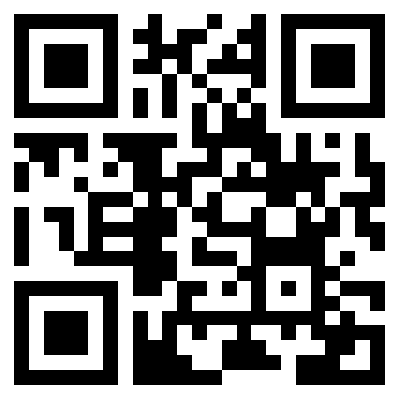

# Oui...

> *...c'est un "kit" pour Vue.js :)*

**Just another set of UI components for Vue.js with a proper French-sounding name.**

Demo at https://oui.holtwick.de. Open via QR Code on mobile:

CSS and Styleguide:

- [oui-stylus](./stylus/README.md)

Libs:

- [oui-float](./lib/float/README.md)
- [oui-notification](./lib/notification/README.md)
- [oui-modal](./lib/modal/README.md)
- [oui-object](./lib/object/README.md)

Dependencies used in some libs:

- [@vueuse/core](https://www.npmjs.com/package/@vueuse/core)
- [@floating-ui](https://www.npmjs.com/package/@floating-ui/dom)
- [zeed](https://www.npmjs.com/package/zeed)

Technologies:

- [Vue 3](https://vuejs.org/)
- [Vite](https://vitejs.dev/)
- [Stylus CSS](https://stylus-lang.com/)
- [Typescript](https://www.typescriptlang.org/)

Derives from this previous work:

- [twindy](https://github.com/holtwick/twindy)
- [twindy-headless](https://github.com/holtwick/twindy-headless)
